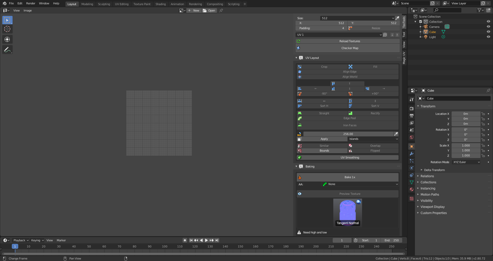
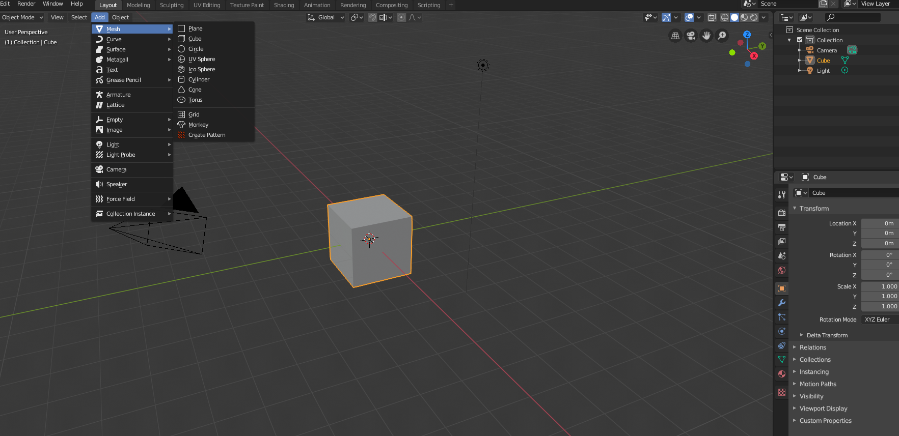

# textools
textools for blender2.8

[文档](http://renderhjs.net/textools/blender/)

[From](https://bitbucket.org/renderhjs/textools-blender/src/master/)

这是适用于blender2.8的版本,欢迎提[issue](https://github.com/BlenderCN/textools/issues)

由于本人精力有限,只能根据issue进行更新,其他也有人在维护的2.8版本,[TexTools-Blender](https://github.com/SavMartin/TexTools-Blender)

